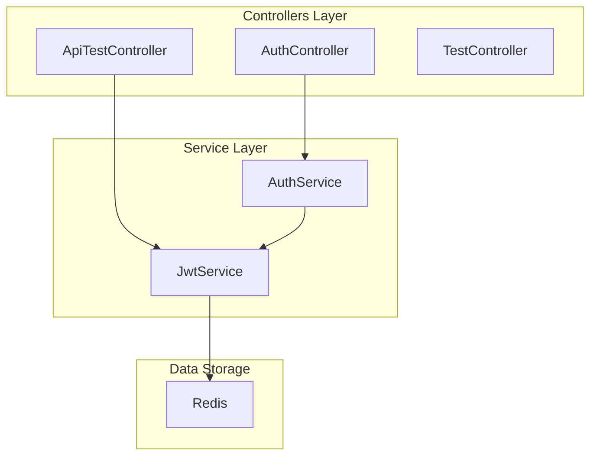
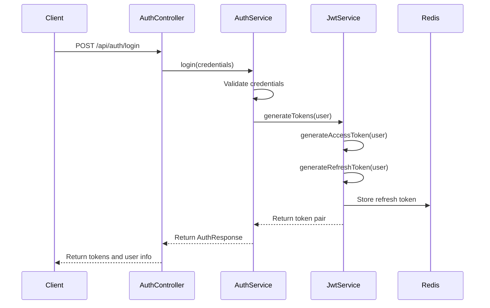
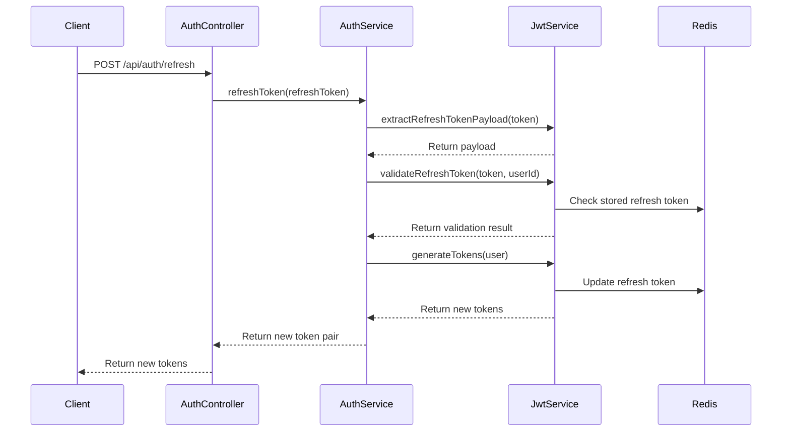
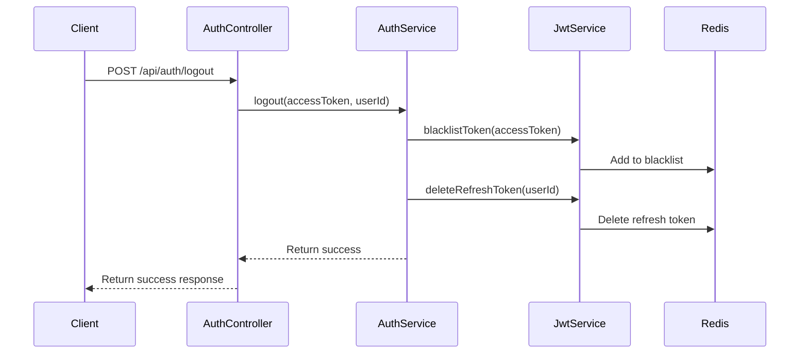
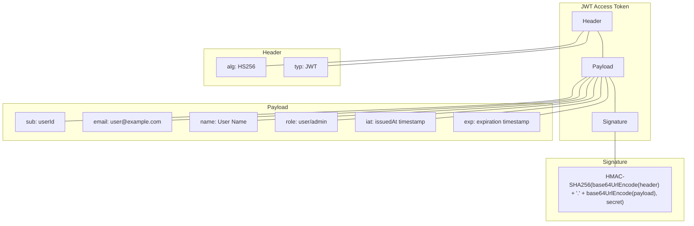
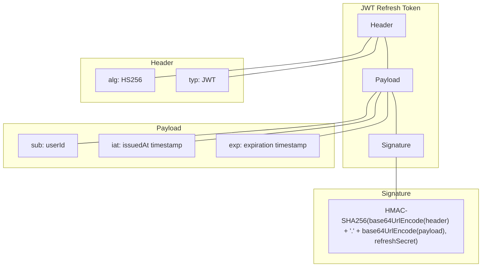

# Spring Boot JWT Authentication Service

This backend service implements a complete JWT (JSON Web Token) authentication system using Spring Boot, providing secure API endpoints for user authentication and authorization.

## Architecture Overview



## Project Structure

```
src/main/java/com/dokalab/auth/
├── config/
│   ├── CorsConfig.java        # CORS configuration
│   ├── RedisConfig.java       # Redis connection configuration
│   └── SecurityConfig.java    # Security settings
├── controller/
│   ├── ApiTestController.java # Protected API endpoints
│   ├── AuthController.java    # Authentication endpoints
│   └── TestController.java    # Basic server test endpoint
├── model/
│   ├── AuthResponse.java      # Authentication response model
│   ├── AuthTokens.java        # Token pair model
│   ├── JwtConstants.java      # JWT configuration constants
│   ├── JwtPayload.java        # JWT payload structure
│   ├── LoginCredentials.java  # Login request model
│   └── User.java              # User information model
├── service/
│   ├── AuthService.java       # Authentication service
│   └── JwtService.java        # JWT token operations
└── AuthServiceTestApplication.java # Main application
```

## Authentication Flow

### Login Process



### Token Refresh Process



### Logout Process



## JWT Token Details

### Access Token Structure



### Refresh Token Structure



## API Endpoints

### Authentication Endpoints

| Endpoint | Method | Description | Request Body | Response |
|----------|--------|-------------|--------------|----------|
| `/api/auth/login` | POST | Authenticate user and issue tokens | `{ "email": "...", "password": "..." }` | `{ "user": {...}, "tokens": {...} }` |
| `/api/auth/refresh` | POST | Refresh tokens | `{ "refreshToken": "..." }` | `{ "accessToken": "...", "refreshToken": "..." }` |
| `/api/auth/verify` | POST | Verify token validity | `{ "token": "..." }` | `{ "valid": true/false }` |
| `/api/auth/logout` | POST | Logout user | `{ "accessToken": "...", "userId": "..." }` | `{ "success": true }` |
| `/api/auth/me` | POST | Get user info from token | `{ "token": "..." }` | User object |

### Test Endpoints

| Endpoint | Method | Auth Required | Description |
|----------|--------|---------------|-------------|
| `/test` | GET | No | Basic server health check |
| `/api/public` | GET | No | Public test endpoint |
| `/api/protected` | GET | Yes | Protected test endpoint |
| `/api/admin` | GET | Yes (admin role) | Admin-only test endpoint |

## Security Features

1. **JWT-based Authentication**: Stateless authentication using signed JWT tokens
2. **Token Refresh Mechanism**: Short-lived access tokens with refresh capability
3. **Token Blacklisting**: Revocation of tokens on logout
4. **Role-based Authorization**: Different access levels based on user roles
5. **Redis Token Storage**: External persistence for refresh tokens and blacklist
6. **CORS Protection**: Configured to allow specific origins only
7. **Secure Signing Keys**: Separate keys for access and refresh tokens

## Configuration

### JWT Settings

JWT settings are defined in `JwtConstants.java`:

```java
public class JwtConstants {
    // JWT secret keys (should be managed with environment variables in production)
    public static final String JWT_SECRET = "a1b2c3d4e5f6g7h8i9j0k1l2m3n4o5p6q7r8s9t0u1v2w3x4y5z6";
    public static final String JWT_REFRESH_SECRET = "z6y5x4w3v2u1t0s9r8q7p6o5n4m3l2k1j0i9h8g7f6e5d4c3b2a1";
    
    // Token expiration times (in seconds)
    public static final int ACCESS_TOKEN_EXPIRY = 15;  // 15 seconds (short time for testing)
    public static final int REFRESH_TOKEN_EXPIRY = 600; // 10 minutes
    
    // Token type
    public static final String TOKEN_TYPE = "Bearer";
}
```

> **Important:** For production, secrets should be stored in environment variables or a secure vault.

### Redis Configuration

Redis connection settings are configured in `RedisConfig.java`:

```java
@Bean
public RedisConnectionFactory redisConnectionFactory() {
    RedisStandaloneConfiguration redisConfig = new RedisStandaloneConfiguration();
    redisConfig.setHostName("127.0.0.1");
    redisConfig.setPort(6379);
    redisConfig.setPassword("userpw");
    return new LettuceConnectionFactory(redisConfig);
}
```

### CORS Configuration

CORS is configured in `CorsConfig.java` to allow requests from specific origins:

```java
// Allow specific origins (client URLs)
config.setAllowedOrigins(Arrays.asList("http://localhost:3000", "http://localhost:3001"));
// Allow all headers
config.addAllowedHeader("*");
// Allow all HTTP methods
config.addAllowedMethod("*");
// Allow credentials (cookies)
config.setAllowCredentials(true);
```

## How to Run

### Prerequisites

- Java 17 or higher
- Maven or Gradle
- Redis server

### Starting the Service

1. Start Redis server (or use Docker):
   ```bash
   docker run --name redis -p 6379:6379 -d redis
   ```

2. Run the application:
   ```bash
   ./mvnw spring-boot:run
   ```

3. The server will start on port 8080.

## Testing

You can use the provided `test-token-refresh.sh` script in the root project folder to test the authentication flow:

```bash
./test-token-refresh.sh
```

This script:
1. Attempts to login with test credentials
2. Tests protected API access
3. Waits for token expiration
4. Tests token refresh
5. Verifies access with the new token

## Security Considerations for Production

For a production environment, consider the following:

1. **Environment Variables**: Move all secrets to environment variables
2. **HTTPS**: Always use HTTPS in production
3. **Token Expiration**: Adjust token expiration times based on security requirements
4. **Strong Keys**: Use a secure random key generator for JWT secrets
5. **Rate Limiting**: Implement rate limiting on login and token refresh endpoints
6. **Monitoring**: Add logging for security events and configure alerts
7. **Regular Rotation**: Implement a mechanism for regular refresh token rotation 